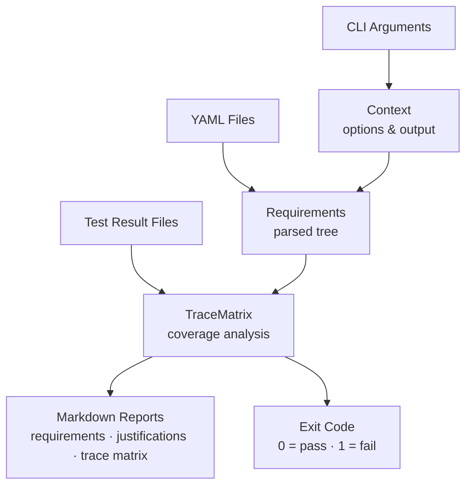

# ReqStream Architecture

This document describes the high-level architecture of ReqStream — the main building blocks, why they
exist, and how they relate to each other.

## Overview

ReqStream is a .NET command-line tool designed to manage requirements written in YAML files. It provides
three core capabilities:

1. **Requirements Management**: Read, parse, and merge requirements from multiple YAML files into a
   hierarchical structure
2. **Trace Matrix Construction**: Map test results (TRX and JUnit formats) to requirements for
   traceability
3. **Test Coverage Enforcement**: Ensure all requirements have adequate test coverage as part of CI/CD
   quality gates

The tool is built with .NET 8.0+, uses YamlDotNet for YAML parsing, and follows a clear separation of
concerns with distinct classes for each major responsibility.

### Components at a Glance

| Component | File | Responsibility |
| --------- | ---- | -------------- |
| `Program` | `Program.cs` | Entry point; orchestrates the execution flow |
| `Context` | `Context.cs` | Parses CLI arguments; owns all options and output |
| `Requirements` | `Requirements.cs` | Reads, merges, and validates YAML requirement files |
| `TraceMatrix` | `TraceMatrix.cs` | Maps test results to requirements; calculates coverage |

Two supporting value types live alongside `TraceMatrix`:

- `TestMetrics` — aggregated pass/fail counts for a named test
- `TestExecution` — a single test result from one result file

### How the Components Fit Together



### Execution Flow at a Glance

1. `--version`  → print version and exit
2. Banner       → printed for all remaining steps (`--help`, `--validate`, normal run)
3. `--help`     → print usage and exit
4. `--validate` → run self-validation tests and exit
5. Normal run   → read requirements → generate reports → enforce coverage

Each step is described in detail in the [Program Execution Flow](#program-execution-flow) section.

## Core Data Model

### Requirement

**Location**: `Requirement.cs`

Represents a single requirement with its metadata.

**Key Characteristics**:

- `Id` must be unique across all requirements files
- `Title` must not be blank
- `Justification` is optional and explains why the requirement exists
- `Tests` lists test identifiers linked to this requirement (inline or via mappings)
- `Children` holds IDs of child requirements for hierarchical decomposition
- `Tags` are optional labels used for categorization and selective filtering

### Section

**Location**: `Section.cs`

Container for requirements and child sections, enabling hierarchical organization.

**Key Characteristics**:

- Sections form a tree structure with arbitrary depth
- Section titles are used to match and merge sections across files
- Sections with identical titles at the same hierarchy level are merged

### Requirements

**Location**: `Requirements.cs`

Root class that extends `Section` and manages YAML file loading and validation.

**Key Responsibilities**:

- Parse YAML files using YamlDotNet with hyphenated naming conventions
- Merge sections with identical hierarchy paths across multiple files
- Validate requirement IDs are unique and titles are non-blank
- Process file includes recursively with loop prevention
- Apply separate test mappings to the matching requirements
- Export requirements and justifications to Markdown reports

### TraceMatrix

**Location**: `TraceMatrix.cs`

Maps test results to requirements and analyzes test coverage.

**Key Responsibilities**:

- Parse test result files in TRX and JUnit formats
- Aggregate test executions from multiple result files by test name
- Match test names to requirements (plain names vs. source-specific `file@testname`)
- Provide fast lookup of test metrics with optional source filtering
- Calculate requirement satisfaction, considering child requirement tests transitively
- Export trace matrix reports to Markdown

### TestMetrics and TestExecution

**Location**: `TraceMatrix.cs`

`TestMetrics` is an immutable record of aggregated pass/fail counts for one test name.
`TestExecution` is an immutable record of results for one test name from one result file.

**Key Characteristics**:

- `TestMetrics(Passes, Fails)` exposes `Executed` (sum) and `AllPassed` (no failures, at least one run)
- `TestExecution` captures the file base name alongside `TestMetrics`, enabling source-specific filtering
- `GetTestResult` returns `TestMetrics(0, 0)` when the test name has no recorded executions
- Both types are used only as read-only value objects — they are never mutated after construction

### Context

**Location**: `Context.cs`

Handles CLI argument parsing and owns all program-wide options and output.

**Key Responsibilities**:

- Parse command-line arguments and validate their values
- Expand glob patterns for requirements and test result files
- Parse `--filter` tags into a set used by all downstream operations
- Manage console and log file output through `WriteLine` / `WriteError`
- Track error state and surface the appropriate process exit code

## Requirements Processing Flow

### 1. YAML File Parsing

ReqStream uses **YamlDotNet** with the `HyphenatedNamingConvention` to deserialize YAML into internal
intermediate types (`YamlDocument`, `YamlSection`, `YamlRequirement`, `YamlMapping`).

- Files are read as text and deserialized; empty or null documents are silently skipped
- File paths in `includes` are resolved relative to the current file's directory
- Validation errors (e.g., missing fields or invalid structure) surface the source file path for actionable error messages

### 2. Section Merging

Sections with **identical titles at the same hierarchy level** are merged across files, enabling
modular requirements spread over many files.

- When a section from a new file matches an existing section by title, their requirements are combined
- Child sections are recursively merged by the same title-matching rule
- This allows teams to contribute to the same logical section from separate files

### 3. Validation

Requirements are validated during parsing to ensure data integrity:

| Validation | Condition | Error |
| ---------- | --------- | ----- |
| Section Title | Must not be blank | `Section title cannot be blank` |
| Requirement ID | Must not be blank | `Requirement ID cannot be blank` |
| Requirement ID | Must be unique | `Duplicate requirement ID found: '{id}'` |
| Requirement Title | Must not be blank | `Requirement title cannot be blank` |
| Test Names | Must not be blank | `Test name cannot be blank` |
| Mapping ID | Must not be blank | `Mapping requirement ID cannot be blank` |

Validation errors throw `InvalidOperationException` with file path context; they are caught in
`Program.Main` and reported to the user.

### 4. Test Mappings

Tests can be associated with requirements in two complementary ways:

- **Inline tests** — listed directly under the requirement in YAML
- **Separate mappings** — listed in the file's `mappings` block and matched by requirement ID

Both methods add entries to the same `Requirement.Tests` list. Mappings are applied after all sections
are processed. A mapping that references a non-existent requirement ID is silently ignored.

### 5. File Includes

The `includes` section of a YAML file triggers recursive processing of additional files.

- Each file's absolute path is tracked; a file encountered a second time is silently skipped
- This prevents infinite include loops regardless of how deeply nested the include graph is
- Missing included files raise `FileNotFoundException`

### 6. Child Requirements

A requirement may list other requirement IDs in its `children` field, forming a hierarchy.

- When evaluating satisfaction, tests from child requirements are collected transitively
- Child requirements can themselves have children (recursive traversal)
- Non-existent child IDs are ignored during satisfaction calculation
- Circular references are detected and rejected at load time (see
  [How Circular Requirement References Are Prevented](#how-circular-requirement-references-are-prevented))

### 7. Tag Filtering

Requirements can carry optional `tags` for categorization.

- When `--filter` is specified, only requirements with at least one matching tag are included
- Tag matching uses OR logic — any matching tag is sufficient to include the requirement
- Filtering applies uniformly to requirements export, justifications export, trace matrix export,
  satisfaction calculation, and enforcement
- When no filter is active, `Context.FilterTags` is `null` and all requirements are included

## Trace Matrix Construction and Analysis

### 1. Test Result File Parsing

ReqStream supports two test result formats via the `DemaConsulting.TestResults.IO` library:

- **TRX** — Visual Studio Test Results format
- **JUnit** — Java/XML test results format

For each test result file, ReqStream uses `DemaConsulting.TestResults.IO.Serializer.Deserialize(content)`
to auto-detect the format and parse the results. If a file cannot be parsed, the underlying error is
wrapped in an `InvalidOperationException` that includes the file path.

### 2. Test Name Matching

ReqStream supports two test name formats, which determine how results are matched to requirements:

**Plain test names** — aggregate results from all result files:

```text
TestFeature_Valid_Passes
```

**Source-specific test names** — restrict matching to files whose base name contains the source part:

```text
windows-latest@TestPlatform_Windows_Passes
ubuntu-latest@TestPlatform_Linux_Passes
```

The `source@testname` format is the mechanism that allows the same logical test to be run on multiple
platforms and tracked independently per platform.

### 3. Requirement Satisfaction Calculation

A requirement is **satisfied** if all of the following hold:

| Criteria | Description |
| -------- | ----------- |
| Has tests | At least one test is mapped (directly or through children) |
| Tests found | All mapped tests exist in test result files |
| Tests executed | All mapped tests have `Executed > 0` |
| Tests passed | All mapped tests have `Passed == Executed` |

A requirement is **unsatisfied** if any of the following apply:

| Condition | Reason |
| --------- | ------ |
| No tests | Requirement has no tests and no children with tests |
| Test not found | A mapped test doesn't exist in any test result file |
| Test not executed | A mapped test has `Executed == 0` |
| Test failed | A mapped test has `Passed != Executed` |

## Test Coverage Enforcement

When `--enforce` is specified, ReqStream calculates requirement satisfaction after generating all
requested reports. If any requirements are unsatisfied, an error message listing each unsatisfied
requirement ID is written to stderr and the exit code is set to 1. Reports are always written before
enforcement results — this allows users to review the trace matrix even on a failing run.

**Exit Code Behavior**:

| Condition | Exit Code | Behavior |
| --------- | --------- | -------- |
| No errors | 0 | Success |
| Argument error | 1 | `ArgumentException` caught in `Main` |
| Enforcement failed | 1 | `Context.WriteError` sets internal error flag |
| Unexpected error | Exception | Printed and re-thrown for event logging |

## Program Execution Flow

### Priority Order

```text
1. Version query (--version)
   └─> Print version and exit

2. Banner
   └─> Print application banner (skipped if version was queried)

3. Help (--help)
   └─> Print usage information and exit

4. Self-Validation (--validate)
   └─> Run self-validation tests and exit

5. Requirements Processing
   ├─> Read and merge requirements files
   ├─> Export requirements report (if --report specified)
   ├─> Export justifications report (if --justifications specified)
   ├─> Parse test result files (if --tests specified)
   ├─> Export trace matrix (if --matrix specified)
   └─> Enforce coverage (if --enforce specified)

Note: When --filter is specified, tag filtering is applied to all exports and enforcement.
```

### Error Handling Patterns

| Exception Type | Usage | Handling |
| -------------- | ----- | -------- |
| `ArgumentException` | Invalid command-line arguments | Caught in `Main`, error printed, exit code 1 |
| `InvalidOperationException` | Runtime errors during execution | Caught in `Main`, error printed, exit code 1 |
| Other exceptions | Unexpected errors | Printed and re-thrown for event logging |

`ArgumentException` is thrown during `Context.Create`; `InvalidOperationException` during execution.
Output methods are only used after successful argument parsing.

## Implementation Notes

### Why Sections Are Merged by Matching Titles

Title-based merging enables **modular requirements management** without any explicit namespace or import
declaration. Benefits:

- Multiple files can contribute to the same logical section
- Requirements, mappings, and justifications can live in separate files owned by separate teams
- A repository can organize files by feature, component, or responsibility and still produce one
  coherent requirement tree

### How Infinite Include Loops Are Prevented

The `Requirements` class maintains a `HashSet<string>` of absolute file paths already processed
(`_includedFiles`). Before reading any file, the path is normalized to an absolute path; if it is
already in the set the file is silently skipped, otherwise it is added and processed.

- Full-path normalization ensures aliases and relative paths resolve to the same entry
- Silent skipping allows the same utility mapping file to be safely referenced from multiple parents
- This prevents infinite recursion and stack overflow with no performance overhead

### How Circular Requirement References Are Prevented

Child requirement IDs can form circular chains (e.g., `REQ-A → REQ-B → REQ-C → REQ-A`). Without
detection these would cause infinite recursion during satisfaction analysis.

`Requirements.Read()` calls `ValidateCycles()` immediately after all files are parsed, before any
downstream analysis begins. The method performs a **depth-first search (DFS)** over every requirement,
using three tracking structures:

- **`visiting`** — requirement IDs on the current DFS stack; a node that appears here while being
  recursed into indicates a back-edge and therefore a cycle
- **`path`** — the ordered sequence of IDs on the current DFS stack, used to build a human-readable
  error message (`REQ-A -> REQ-B -> REQ-C -> REQ-A`)
- **`visited`** — IDs whose entire sub-tree has been confirmed cycle-free; these are skipped on future
  encounters, keeping the overall check O(n) over all requirements

Cycle detection runs once at load time before any analysis; a clear `InvalidOperationException` with
the full cycle path is thrown on detection. Because the guarantee is established at load time,
`TraceMatrix.CollectAllTests()` recurses through child requirements without its own cycle guard.

### Design Decisions for Maintainability

**Separation of Concerns**:

- `Context` owns CLI argument handling and output; it never touches YAML or test results
- `Requirements` owns YAML parsing and merging; it never touches test results or reports
- `TraceMatrix` owns test result analysis; it receives an already-validated requirements tree
- `Program` owns execution flow; it delegates all work to the other three components

**Immutable Data Structures**:

- Properties prevent modification after construction; collections allow population during
  construction but not replacement
- `TestMetrics` and `TestExecution` are immutable records

**Error Context and Testability**:

- Validation and parsing errors always include the source file path for actionable debugging
- Static factory methods (`Context.Create`, `Requirements.Read`) decouple construction from consumers
- Public satisfaction-calculation methods and clear parsing/analysis separation enable direct testing

**Key Architectural Patterns**:

- **Factory** — `Context.Create(args)` and `Requirements.Read(paths)` encapsulate object construction
- **Composite** — `Section` trees enable recursive traversal for export and satisfaction calculation
- **Strategy** — test result parsing tries TRX first, then JUnit; matching tries source-specific first,
  then plain names
- **Disposable** — `Context` implements `IDisposable` for deterministic log file cleanup

---

For questions or suggestions about this architecture document, please open an issue or submit a pull
request.
