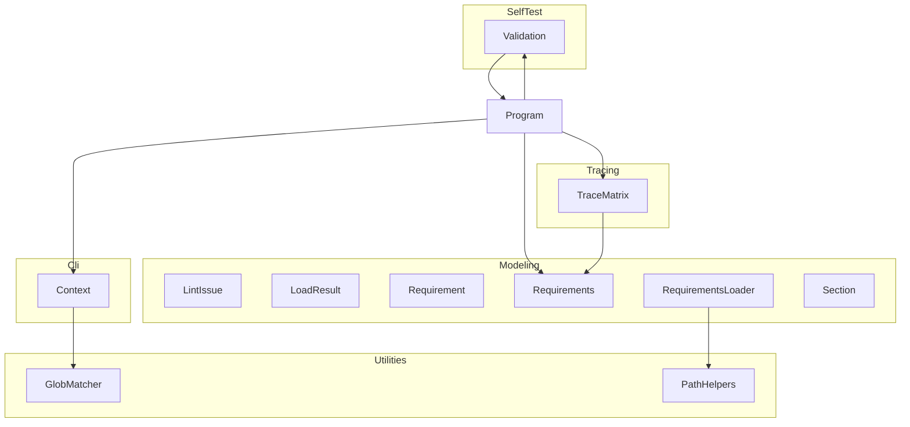
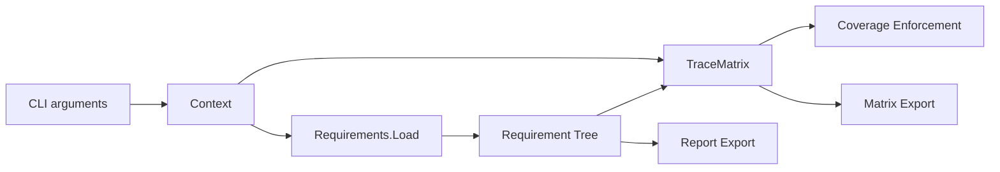

# ReqStream

## Architecture

The ReqStream system is a single executable (.NET tool package) organized into the following
software items:

The collaboration model is strictly hierarchical: `Program` is the only unit that calls into
multiple subsystems; subsystems do not call other subsystems directly. The one intentional
exception is the `SelfTest/Validation` unit, which calls `Program.Run` to re-invoke the tool
pipeline as part of self-testing; this is the only feedback cycle in the architecture. The
`Context` object is the single shared state carrier passed from `Program` to the units that need
to produce output.

| Item | Type | Responsibility |
| ---- | ---- | -------------- |
| `Program` | Unit | Entry point and top-level dispatch orchestrator |
| `Cli` | Subsystem | Command-line argument parsing and I/O ownership |
| `Context` | Unit | Argument parser, output channels, and exit code |
| `Utilities` | Subsystem | Shared low-level file-system helpers |
| `GlobMatcher` | Unit | Glob pattern expansion to file paths |
| `PathHelpers` | Unit | Path combination with traversal protection |
| `Modeling` | Subsystem | YAML requirements data model and parsing |
| `LintIssue` | Unit | Lint issue severity and data model |
| `LoadResult` | Unit | Combined load outcome (tree and issues) |
| `Requirement` | Unit | Single requirement data-transfer object |
| `Requirements` | Unit | Requirements tree root and export entry point |
| `RequirementsLoader` | Unit | YAML deserializer and lint validator |
| `Section` | Unit | Named requirements group and tree node |
| `Tracing` | Subsystem | Test result loading and requirement traceability |
| `TraceMatrix` | Unit | Test result loader, mapper, and coverage enforcer |
| `SelfTest` | Subsystem | Built-in self-validation framework |
| `Validation` | Unit | Self-validation test runner |

## External Interfaces

**Command-line arguments**: Space-separated flag/value pairs parsed by `Context.Create`.

- *Type*: CLI.
- *Role*: Consumer (the user provides arguments to the system).
- *Contract*: Defined flag set (`--version`, `--help`, `--silent`, `--validate`, `--lint`,
  `--enforce`, `--requirements`, `--tests`, `--report`, `--matrix`, `--justifications`,
  `--filter`, `--depth`, `--report-depth`, `--matrix-depth`, `--justifications-depth`,
  `--results`, `--log`); unknown flags cause `ArgumentException`.
- *Constraints*: No interactive prompts; all information must be on the command line.

**Standard output (stdout)**: Plain text lines via `Context.WriteLine`.

- *Type*: Console stream.
- *Role*: Provider.
- *Contract*: Human-readable output lines; suppressed when `--silent` is active.
- *Constraints*: None.

**Standard error (stderr)**: Plain text error lines via `Context.WriteError`.

- *Type*: Console stream.
- *Role*: Provider.
- *Contract*: Error messages; written by `Context.WriteError`, which also sets the process exit
  code to `1`; suppressed when `--silent` is active.
- *Constraints*: None.

**YAML requirements files**: Input files conforming to the ReqStream requirements schema.

- *Type*: File (YAML).
- *Role*: Consumer.
- *Contract*: YAML mapping nodes validated by `RequirementsLoader`; parse errors returned as
  `LintIssue` objects.
- *Constraints*: Files must be accessible on the local file system.

**Test result files**: TRX (MSTest) or JUnit XML files.

- *Type*: File (XML).
- *Role*: Consumer.
- *Contract*: Auto-detected by `DemaConsulting.TestResults.IO.Serializer`; fatal error reported
  if a file is missing or cannot be parsed.
- *Constraints*: Files must be accessible on the local file system.

**Report files**: Requirements report, justifications report, and trace matrix report.

- *Type*: File (Markdown).
- *Role*: Provider.
- *Contract*: Paths from `--report`, `--justifications`, and `--matrix` respectively.
- *Constraints*: Directory must exist and be writable.

**Log file**: Optional plain text log mirroring stdout.

- *Type*: File (plain text).
- *Role*: Provider.
- *Contract*: Path from `--log`; written by Context log writer.
- *Constraints*: Directory must exist and be writable.

**Validation results file**: Structured test output in TRX or JUnit XML format.

- *Type*: File (XML).
- *Role*: Provider.
- *Contract*: Path from `--results`; written by `Validation.WriteResultsFile`.
- *Constraints*: Extension must be `.trx` or `.xml`.

**Process exit code**: Integer signal to the calling process.

- *Type*: Process exit code.
- *Role*: Provider.
- *Contract*: `0` = success; `1` = any error reported via `Context.WriteError`.
- *Constraints*: None.

## Dependencies

- **YamlDotNet** — used for YAML parsing via the RepresentationModel DOM API in
  `RequirementsLoader`; see *YamlDotNet Integration Design*
- **Microsoft.Extensions.FileSystemGlobbing** — used for glob pattern matching in
  `GlobMatcher.FindMatchingFiles`; see *Microsoft.Extensions.FileSystemGlobbing Integration Design*
- **DemaConsulting.TestResults** — used for test result deserialization (TRX, JUnit) in
  `TraceMatrix` and `Validation`; see *DemaConsulting.TestResults Integration Design*

## Risk Control Measures

N/A — not a safety-classified software item. ReqStream is a development tooling component with no
direct safety implications. The following defensive measures are implemented as engineering best
practices rather than safety controls:

- **Error isolation at process boundary** — `Program.Main` catches `ArgumentException` and
  `InvalidOperationException`, preventing unhandled exceptions from reaching the operating system
  in normal error conditions.
- **No shared mutable state across subsystems** — each subsystem receives only the data it needs.
  `Context` is the sole shared state carrier.
- **Output channel separation** — normal output uses `Context.WriteLine` (stdout); errors use
  `Context.WriteError` (stderr).
- **Path traversal prevention** — `PathHelpers.SafePathCombine` validates all relative path
  combinations against the base directory before use.
- **Include loop guard** — `RequirementsLoader` tracks visited file paths in a `HashSet`,
  preventing infinite recursion on circular `includes` graphs.
- **Acyclic child-requirement graph** — `RequirementsLoader.ValidateCycles` confirms the
  child-requirement graph is acyclic before downstream analysis.

## Data Flow

1. **Argument parsing** — `Context.Create(args)` parses all CLI flags and expands glob patterns
   in `--requirements` and `--tests` arguments.
2. **Requirements loading** — `Requirements.Load(context.RequirementsFiles)` reads and merges all
   YAML requirements files into a single requirement tree, following `includes` recursively.
   Sections are merged by matching their full title hierarchy path: when two loaded files define
   sections with identical title paths, their child requirements are combined into a single section
   node.
3. **Report generation** — if `--report` is set, the requirements report is exported. If
   `--justifications` is set, the justifications report is exported.
4. **Test result loading** — if `--tests` is set, a `TraceMatrix` is constructed from the test
   result files and the requirement tree.
5. **Trace matrix export** — if `--matrix` is set and a `TraceMatrix` was constructed, the trace
   matrix report is exported. If `--matrix` is set but no `--tests` were provided (so no
   `TraceMatrix` was constructed), an error is reported via `Context.WriteError` and the tool exits
   with a non-zero exit code.
6. **Enforcement** — if `--enforce` is set and a `TraceMatrix` was constructed,
   `EnforceRequirementsCoverage` verifies all requirements are covered by passing tests. If
   `--enforce` is set but no `--tests` were provided (so no `TraceMatrix` was constructed), the
   tool reports an error via `Context.WriteError` and exits with a non-zero exit code.
7. **Tag filtering** — if `--filter` is set, `Context.FilterTags` restricts which requirements
   appear in reports and enforcement. Filtering is applied transparently at each operation rather
   than as a separate pipeline stage.
8. **Report depth** — the `--depth` flag sets a default heading level for all reports.
   Per-report overrides (`--report-depth`, `--matrix-depth`, `--justifications-depth`) take
   precedence.

Alternative flows:

- `--version` prints the version string and exits immediately before any pipeline steps.
- `--help` prints usage information and exits immediately.
- `--validate` delegates entirely to `Validation.Run(context)` for self-validation.
- `--lint` loads requirements files, reports lint issues, and exits without further processing.

## Design Constraints

- **Platform portability** — no platform-specific APIs are used. All runtime dependencies ship as
  portable NuGet packages. The tool functions identically on Windows, Linux, and macOS.
- **Multi-framework targeting** — the project targets `net8.0`, `net9.0`, and `net10.0`.
  All language and library features must be available on all three target frameworks.
- **Nullable reference types enabled** — the compiler is configured with
  `<Nullable>enable</Nullable>`. All APIs handle null inputs explicitly.
- **Zero compiler warnings** — the project uses `<TreatWarningsAsErrors>true</TreatWarningsAsErrors>`.
- **No interactive prompts** — ReqStream is designed for CI/CD use. The tool never blocks waiting
  for user input.
- **Stateless between invocations** — the tool holds no persistent state between runs. Each
  invocation is independent and idempotent given the same inputs and file system state.
